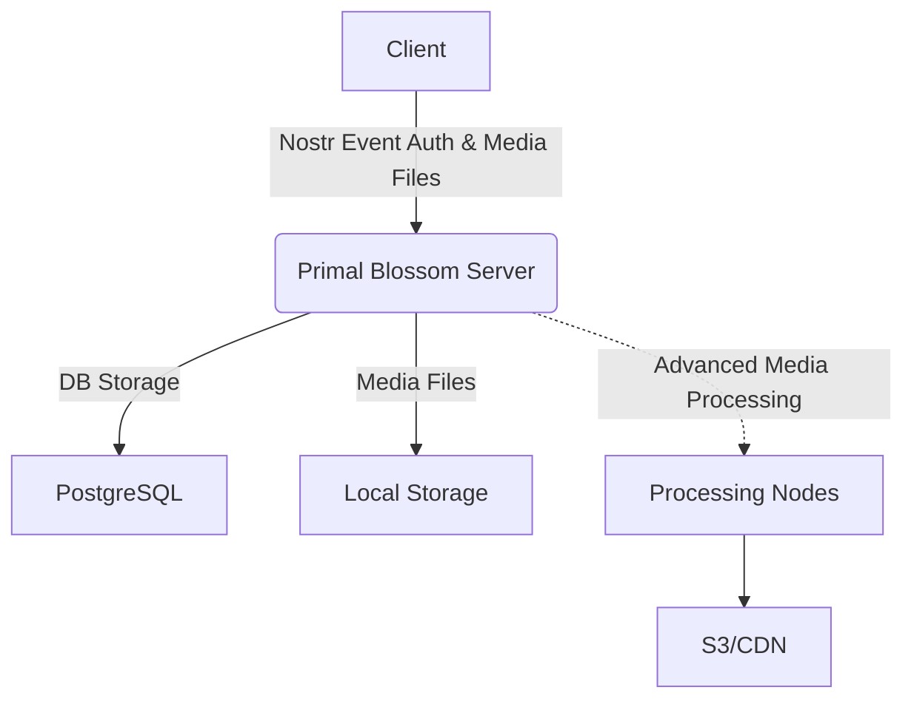

<br />

<div align="center">
    
</div>

# Primal Blossom Server

A Nostr-based media server implementing Blossom protocol [https://github.com/hzrd149/blossom].

## Features

- Media upload and storage (images, videos, files)
- Media metadata stripping using ExifTool and FFmpeg
- PostgreSQL-backed storage management
- Nostr event-based authentication
- Content delivery via local storage or CDN
- Sub-process sandboxing capabilities
- Rolling upgrades and zero-downtime deployment

## Architecture Overview



## Prerequisites

### System Requirements
- Nix (for development and runtime environment)
- PostgreSQL
- ExifTool
- FFmpeg

## Usage

- Create PostgreSQL database using `schema.sql`

- Insert at least one storage location into `media_storage_priority` table:

```sql
INSERT INTO media_storage_priority VALUES ('st1', 1000); -- should match local storages key in config file
```

- Create `primal-blossom-server-config.json` to match your database settings

- Run the following command:

```bash
nix develop -c sh -c '$rustup_init; DATABASE_URL="postgresql://..." RUST_BACKTRACE=1 $cargo +nightly run --quiet -- --config-file primal-blossom-server-config.json serve'
```

## API Endpoints

### Upload
```
PUT /upload
Authorization: Nostr <base64-encoded-auth-event>
X-SHA-256: <sha256sum>
Content-Type: application/octet-stream

<binary data>
```

### Upload with Metadata Stripping
```
PUT /media
Authorization: Nostr <base64-encoded-auth-event>
X-SHA-256: <sha256sum>
Content-Type: application/octet-stream

<binary data>
```

### Mirroring
```
PUT /mirror
Authorization: Nostr <base64-encoded-auth-event>
X-SHA-256: <sha256sum>
Content-Type: application/json

{
  "url": "https://blossom.example.net/SHA256.jpg"
}
```

### Download
```
GET /<sha256>
GET /<sha256>.<ext>
```

### Listing User Uploads
```
GET /list/<pubkey>
Authorization: Nostr <base64-encoded-auth-event>
```

### Deletion
```
DELETE /<sha256>.<ext>
X-SHA-256: <sha256sum>
Authorization: Nostr <base64-encoded-auth-event>
```

## Security Considerations

- Use Nginx as reverse proxy
- Enable sub-process sandboxing

## Database Schema

### Tables
- `media_uploads`: User media metadata
- `media_storage`: Storage location mapping
- `media_storage_priority`: Storage backend preferences
- `media_metadata_stripping`: Record of metadata removals

## License

This project is licensed under the MIT License.

## Acknowledgments

- Based on the Blossom protocol specifications
- Uses several open-source libraries (axum, sqlx, nostr-sdk)

